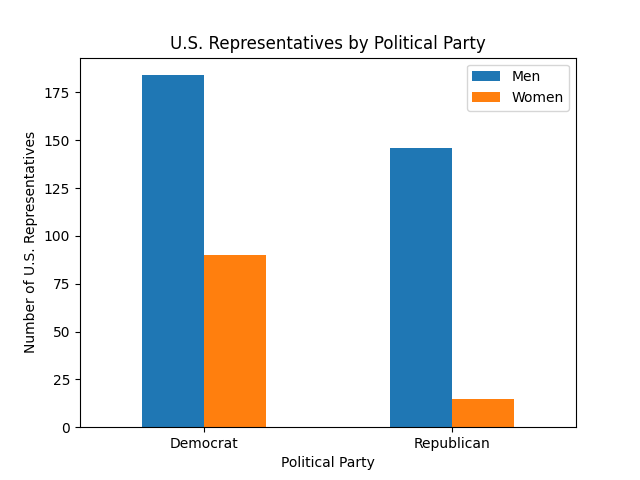

# Homework 2
Check out Mike's page for more info on this project! [CMC-csci040's Homework 2](https://github.com/mikeizbicki/cmc-csci040/tree/2020fall/hw_02)
## United States' Population

The above graph demonstrates the steadily increasing population of the United States. The data has been collected from 1960 to 2019, with data from 2020 not yet available as the year hasn't yet ended. As seen on the graph, the U.S. population has nearly doubled since data was first collected in 1960. The dataset used for this graph can be found [here](https://github.com/jdorfman/awesome-json-datasets).
## United States' Representatives

The above graph shows the number of U.S. Representatives from the House of Representatives divided by political party as well as gender. Democratic representatives are on the left side of the graph while Republican representatives are on the right. Men are represented by blue while women are orange. As seen on the graph, a larger portion of Democratic reps are women than Republican reps. The dataset used for this graph can be found [here] (https://github.com/jdorfman/awesome-json-datasets).

