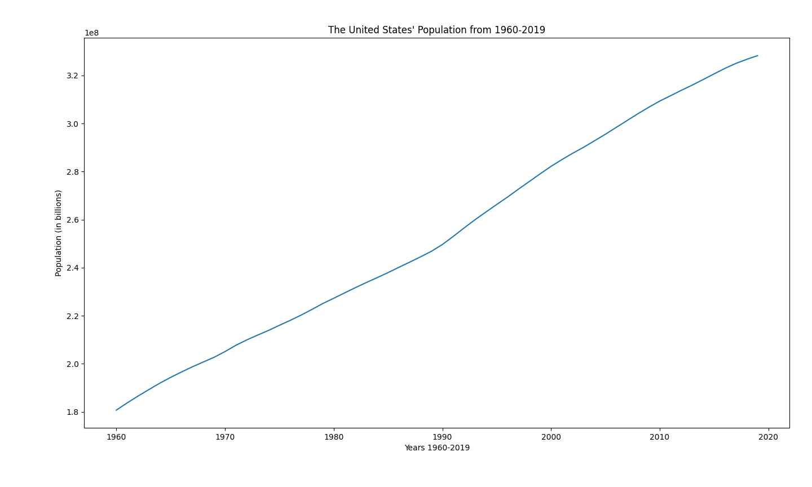

# Homework 2
Check out Mike's page for more info on this project! [CMC-csci040's Homework 2](https://github.com/mikeizbicki/cmc-csci040/tree/2020fall/hw_02)
## United States' Population

The above graph demonstrates †he steadily increasing population of the United States. The data has been collected from 1960 to 2019, with data from 2020 not yet available as the year hasn't yet ended. As seen on the graph, the U.S. population has nearly doubled since data was first collected in 1960. The dataset used for this graph can be found [here](https://github.com/jdorfman/awesome-json-datasets)

